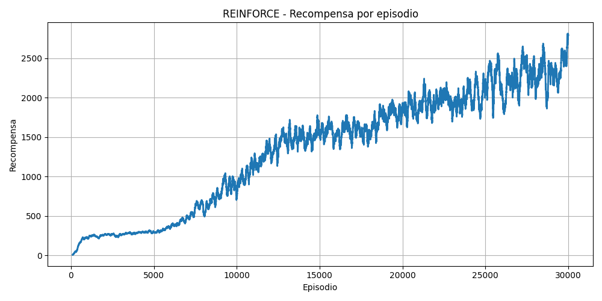

# 🐍 Agente Inteligente para Snake con REINFORCE

## Descripción del Proyecto

Este proyecto consiste en un agente inteligente que aprende a jugar al clásico juego de la víbora (Snake) utilizando **aprendizaje por refuerzo** con el algoritmo **REINFORCE**, una técnica basada en gradiente de política.

El entorno del juego fue creado completamente desde cero, al igual que la implementación del algoritmo de aprendizaje. La red neuronal que representa la política del agente fue desarrollada con **PyTorch**, y la visualización del entorno se realiza con **Pygame** durante la evaluación.

## Funcionamiento

Durante el entrenamiento, el agente juega múltiples partidas y aprende a mejorar su política a partir de la señal de recompensa que recibe. Esta señal se define de la siguiente manera:

- **Comer la fruta:** recompensa positiva.

- **Colisionar con una pared o con sí mismo:** castigo (recompensa negativa).

- **Moverse sin colisionar:** pequeña recompensa neutra o ligeramente positiva.

- **Acercarse o alejarse de la fruta:** se entrega una recompensa proporcional a la distancia normalizada.

⚙️ **Entrenamiento independiente del tamaño de cuadrícula:**  
El agente no depende de un tamaño específico del entorno. Gracias a la normalización de las entradas y las recompensas (por ejemplo, la distancia a la fruta), puede entrenarse en una cuadrícula de tamaño `n x n` y luego aplicarse en una cuadrícula distinta `m x m` sin necesidad de reentrenar.

El algoritmo REINFORCE calcula el retorno acumulado con descuento y ajusta los pesos de la política siguiendo la siguiente fórmula:

$$
\nabla J(\theta) = \mathbb{E}[\nabla \log \pi_\theta(a_t|s_t) \cdot G_t]
$$

donde $G_t$ es el retorno acumulado desde el paso $t$, calculado de forma recursiva.

## Evaluación del Aprendizaje

Para evaluar el desempeño del agente, se registraron y visualizaron las siguientes métricas:

- **Gráfica de recompensa total por episodio** con promedio móvil.

- **Visualización en tiempo real del agente jugando** mediante `pygame`, solo en la fase de evaluación.

Además, se implementó una opción para guardar el modelo entrenado y reutilizarlo luego sin necesidad de volver a entrenar.

## Resultados

El agente es capaz de mejorar progresivamente su desempeño, logrando sobrevivir más tiempo, recolectar más frutas y evitar colisiones.

Se observa que a medida que el entrenamiento avanza:

- El puntaje promedio por episodio aumenta.
- La política comienza a evitar movimientos aleatorios y a mantener trayectorias más eficientes.
- Se presenta una tendencia natural al zigzag debido a la estocasticidad de la política.

> El comportamiento final depende fuertemente de los hiperparámetros como la tasa de aprendizaje, `gamma` (factor de descuento), y la estructura de recompensas.



## Instalación y Uso

Clona el repositorio:

```
git clone https://github.com/tobiasgrandi/Agente_Snake_Game
cd Agente_Snake_Game
```
Para visualizar la evaluación:
```
python evaluate.py
```
Para entrenar:
```
python train.py
```
